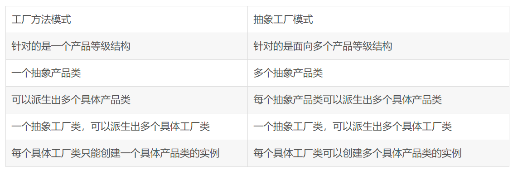

# 创建型

- 单例: singleton
- 原型: prototype
    - 克隆生成对象
- 工厂方法: factoryMethod
    - 延迟到子类实现
    - 工厂中只定义接口方法,不提供具体实现
        - 父类定义创建接口
        - 子类实现具体接口
        - 工厂定义的方法只生产某一类产品
            - 生产宝马
- 抽象工厂: abstractFactory
    - 选择产品族的实现
    - 工厂定义的方法可以生产多种产品
        - 生产宝马
        - 生产奔驰
    - 抽象工厂和工厂方法的区别
        - 
- 建造者: builder
    - 分离 整体构建算法 和 部件构造
      - 

# 结构型

- 代理: proxy
    - 控制对象访问
- 适配器: adapter
    - 转换匹配,复用功能
- 桥接: bridge
- 装饰器: decorator
    - 动态组合(动态是手段,组合是目的)
    - 对客户端透明的方式扩展对象的功能
- 外观: facade
    - 封装实现细节,简化调用
- 享元: flyweight
- 组合: composite
    - 统一叶子对象和组合对象

# 行为型

- 模版方法: template
    - 固定算法骨架
- 策略: strategy
    - 分离算法,选择实现
- 命令: command
    - 控制实例数量
- 职责链: chainOfResponsibility
    - 分离职责,动态组合
- 状态: state
    - 根据状态来分离和选择行为
    - 状态驱动,上下文负责
- 观察者: observer
    - 触发联动
- 中介者: mediator
    - 封装交互
- 迭代器: iterator
- 访问者: visitor
- 备忘录: memento
    - 保存和恢复内部状态
- 解释器: interpreter
